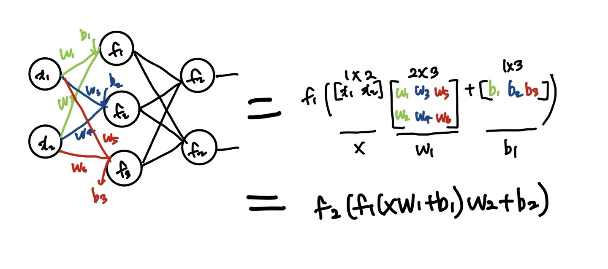

# Chapter 5

### <MLP, 행렬과 벡터로 표현>
: 웨이트 곱하고 바이어스와 함께 더하고 액티베이션

  

### <비선형 액티베이션의 중요성>
**층과 노드를 더 많이 사용하여 깊어질수록 비선형 함수를 사용해야 함** 
if, 선형 액티베이션 사용 -> FC 레이어 한 층과 동일한 수준  
선형 액티베이션은 언제? 
-> 회귀 문제에서 마지막 층은 선형 액티베이션을 사용(출력값의 범위가 제한되지 않아야 하므로)
-> 노드 수가 줄어드는 레이어에서 정보 손실을 막기 위해

비선형: 네트워크 '복잡도'증가, '정보 손실'야기 가능
선형: '정보 손실' 없음, '복잡도'증가 불가 