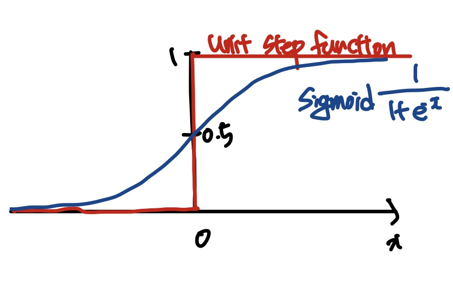

# Chapter 6

### <Unit Step Function을 이용한 이진 분류>
ex) 키와 몸무게를 입력으로 받아 체중 감량이 필요한지(1), 체중 증가가 필요한지(0) 판단하는 이진 분류 문제

Step 1. 데이터 수집: 감량과 증가의 경계에 있는 데이터가 많을수록, 더 정확한 분류 경계선을 그릴 수 있음   
Step 2. 모델 설계: 퍼셉트론 모델 -> 분류 경계선(선형)    
Step 3. 모델 학습: 학습 목표 세 파라미터 a, b, c를 최적화하여 새로운 데이터에 대해 정확한 판단을 내리는 것    
Step 4. 모델 테스트: 새로운 데이터에 대해 올바르게 예측하는지 확인   
(비선형 활성화 함수를 사용하기 때문에 입력과 출력의 관계는 비선형, 분류 기준은 선형)    

-> 미분 불가능, 극단적 분류의 문제점  

**Sigmode** 
-> 전 구간 미분 가능: 그래디언트 기반 최적화 기법을 사용할 수 있음 
-> 출력값의 범위 0~1: 출력을 정도, 확률로 해석 가능 -> 더 합리적인 분류 경계선을 찾을 수 있음 
 

### <Sigmoid를 이용한 이진 분류>
**BCE Loss** 사용 
강아지 사진 출력 1, 고양이 사진 출력 0
> $q^y (1 - q)^{1 - y}$
== AI 가 예측한 해당 동물일 확률 

Mini-Batch 방식을 사용한다면 .. 예측 확률 모두 곱해야 함(독립사건) -> Underflow 문제 발생 가능 
-> 자연로그를 취함(단조 증가 함수)    

$-\log q_n^{y_n} (1 - q_n)^{1 - y_n}$ : 두 가지 가능한 결과에 대한 Cross-Entropy이기 때문에 BCE라 불림   

**로지스틱 회귀**
입력과 출력 사이의 관계를 확률 함수로 표현하고 이 함수를 은닉층이 없는 인공 신경망으로 놓고 추정하는 방법    

### <MSE Loss vs BCE Loss>
왜 이진 분류에서 BCE Loss를 쓸까?   
1. $(q - 1)^{2}$과 $-\log q$ 함수를 비교 했을 때 BCE가 상대적으로 예측 오류에 민감하게 반응
2.  
- MSE Loss: $\left( \frac{1}{1 + e^{-w}} - 1 \right)^2$ **Non-Convex**
- BCE Loss: $- \log \left( \frac{1}{1 + e^{-w}} \right)$ **Convex** 
convex: 아래로 볼록, Global Minimum만을 가진다는 뜻 
즉, 잘못된 예측에 강한 페널티 부과, 최적화 과정에서 더 안정적인 특성을 보여줌  

### <딥러닝과 MLE>
**MLE**: likelihood, 관측된 Measurement가 나올 가능성을 최대로 하는 파람터를 찾는 과정   
-> 이 입력($x1$) 에는 이 출력($y1$) 이 나올 확률을 키워야 해! 
**NLL**: Likelihood에 -log를 취한 것   

1. $-\log q_1$: $y_1$이 $y_1 = 1$일 확률이 $q_1$인 **베르누이 분포**를 따른다고 가정하고,   
   Likelihood $P(y_1 | \mathbf{w})$를 최대화하는 파라미터 $\mathbf{w}$를 추정하기 위해 NLL을 Loss로 사용   

2. $(q_1 - 1)^2$: $y_1$이 $y_1$의 평균이 $q_1$인 **가우시안 분포**를 따른다고 가정하고,   
   Likelihood $P(y_1 | \mathbf{w})$를 최대화하는 파라미터 $\mathbf{w}$를 추정하기 위해 NLL을 Loss로 사용   

MAE: 라플라스 분포, 가우시안 분포에 비해 꼬리 부분의 확률 밀도가 더 크기 때문에   
    outlier에 덜 영향을 받는 특성이 있어, MAE Loss가 더 적합   

### <다중 분류>
- 강아지: [1,0,0]
- 고양이: [0,1,0]
- 소: [0,0,1]
-> one-hot-encoding: 각 클래스를 동등하게 취급, 모델이 각 클래스를 독립적으로 학습함.    

[0,100,0], [-1,1,-1].. [0,1,0]보다 두번째 노드 값이 두드러지게 나오지만 실제 레이블과는 멀어짐   
->**Softmax** 사용: 각 출력값은 양수, 그 합이 1이 되도록 제한   
- 확률 분포로 해석 가능
- 개별 노드 값이 아닌 모든 출력 노드의 값을 동시에 고려  

**Cross-Entropy Loss** 
: 다중 분류에서 레이블이 카테고리 분포(멀티누이 분포)를 따른 다고 가정, 이로 얻은 Loss 함수   
> $-y_1 \log y_1 - y_2 \log y_2 - y_3 \log y_3 \leq -y_1 \log q_1 - y_2 \log q_2 - y_3 \log q_3$
[1,0,0] -> q1만을 1에 가깝게 만드는게 목표 -> Softmax 특성: 출력 합이 1 
-> 나머지 값들은 자연스럽게 0에 가까워 짐  

### <Softmax 회귀>
: 선형 회귀를 통해 Logit들을 예측하고, 이를 확률 분포로 변환하여 다중 분류 문제를 해결하는 방법

