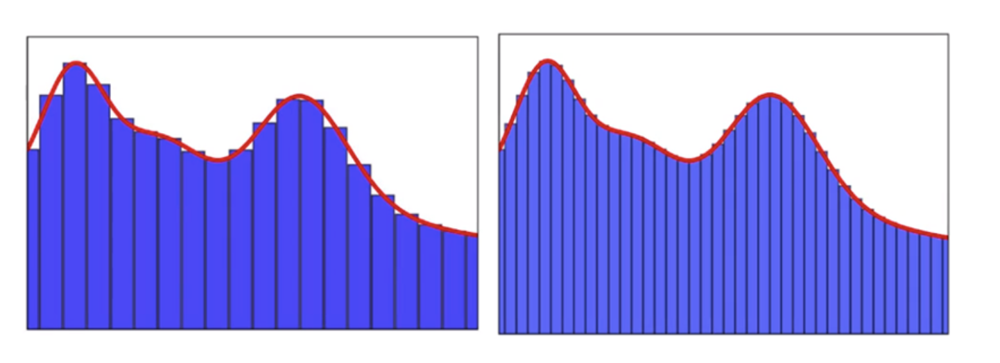

# Chapter 7   
   
### Universal Approximation Theorem
"인공 신경망의 한계는 어디일까?" -> 신경망은 모든 함수를 표현할 수 있다!   
**MLP 는 히든 레이어가 단 한층만 있어도 제한된 범위 안의 어떤 연속 함수든 나태낼 수 있음**   
**즉, Loss를 0에 가깝게 만들기 가능** 

 

DNN 사용 이유: 효율성을 위해 노드 수를 줄이는 대신 층 수를 늘리는 방식

**오해와 진실**
- Universal Approximation Theorem은 AI의 학습 방식을 설명하는 것이 아님   
    MLP의 강력한 표현력 설명, 과적합 문제 있음   
- Universal Approximation Theorem으로 FC레이어만 사용?   
    MLP나 FC 레이어가 가장 효율적인 구조라는 뜻은 아님     
   
**결론적으로 이는 인공 신경망의 강력한 표현력을 보여주는 정리!!**