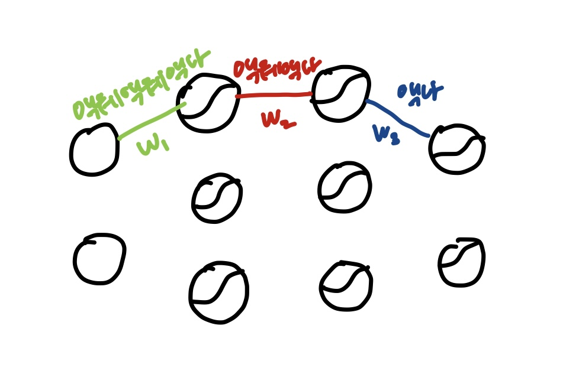
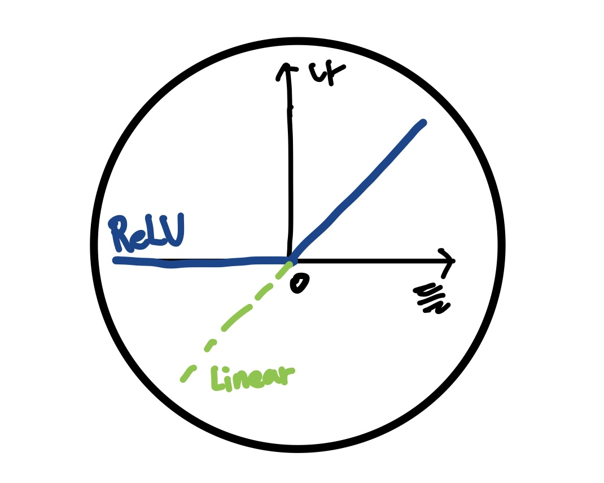
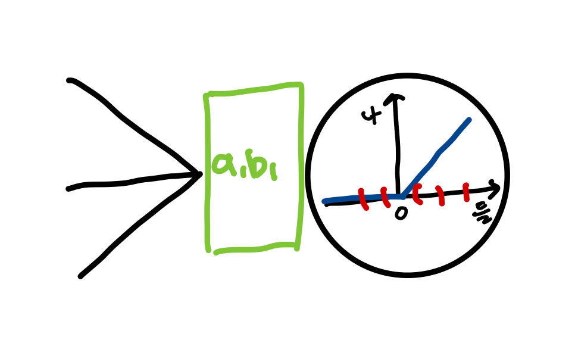
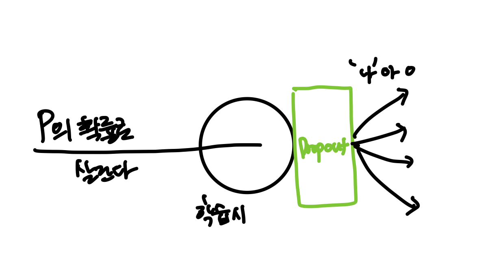

# Chapter 8

### 1. 기울기 소실
: 입력층으로 갈수록 해당 층의 그래디언트 크기가 0에 가까워져 학습이 거의 이루어지지 않는 현상

 
 
모든 층의 활성화 함수를 sigmoid로 하는 신경망의 경우 
액: Sigmoid 함수의 미분, 최대값이 1/4 -> 여러번 곱해질수록 급격히 0에 가까워짐 -> 기울기 소실!   
   
**문제**
- 입력층에서 문제가 발생하면 출력층이 아무리 좋은 성능을 낸다고 해도 좋은 결과를 얻을 수 없음
- 과소적합: Loss를 제대로 줄이지 못함, 훈련데이터의 패턴을 충분히 학습x, 데이터와 동떨어진 함수를 학습   
     
### 2. ReLU
: "들" 값이 양수일때는 그대로 출력하고, 음수일때는 0을 출력하는 화성화 함수

  

"액" 이 음수일때 전체가 0이 되니 기울기 소실에 취약?    
-> 충분한 노드가 존재 한다면 모든 경로에서 확실하게 살릴(양수) 경로들만 더하여 해결!   
-> 음수 부분을 조금 더 고려하는 **Leaky ReLU, Parametric ReLU"** 등장   
-> 0에서 꺾음으로써 기울기 소실 문제 완화, 비선형성 확보(vs Linear, Sigmoid)  
### 3. 배치 정규화
: Batch에 대한 평균과 표준편차를 이용해 정규화를 수행하는 방식   

  

ex) Batch size가 5인 경우 ReLU함수를 만났을때:   
5개의 "들"값이 양수라면? 또는 모두 음수라면? --> 일부는 음수, 일부는 양수로 적절하게 들어가야 함  
       
$a \left( \frac{X - \overline{X}}{\sigma_X} \right) + b$   
   
평균: $b$, 분산: $a^2$ --> Loss를 줄이는 방식으로 재배치 위치 학습   
- 주로 "들" 값에 적용, 원하는 층에 적용 가능(하이퍼파리미터)
- 배치정규화 사용 층은 일반적으로 바이어스 적용 안함(b가 대체)
- 학습 시와 테스트 시 다르게 동작 -> Batch size가 다름 -> EMA로 해결
- 배치 사이즈가 작을수록 EMA 적용 어려움 -> 레이어 정규화   
   
### 4. 레이어 정규화
: 레이어에 들어가는 "들" 값들을 샘플로 사용해 평균과 분산을 구한다.
- Batch size에 영향을 받지 않는다
- 자연어 처리에 사용(Padding 토큰)
   
### 5. Loss Landscape, ResNet Skip-Connection
기울기 소실 문제가 해결 되었음에도 모델이 깊어질수록 훈련 데이터와 테스트 데이터 모두에 대한 성능이 오히려 떨어지는 과소적합 문제 발생 
-> Loss Landscape: 모델이 깊어질수록 Loss 함수의 모양이 복잡해져 학습이 어려워진다는 것   
-> Skip-Connection 모델 적용으로 해결
 

### 6. 과적합
**Overfitting**: 모델이 훈련 데이터에 대해서는 우수한 성능을 보이지만, 일반화 능력은 떨어지는 현상   
- 모델 경량화: 모델이 풀고자 하는 문제에 비해 지나치게 복잡하기 때문에   
- 조기 종료: 검증 데이터로 최적의 학습 시점을 찾아 Overfitting을 방지
- 데이터 증강: 사진 일부 잘라내기, 채도,명도,색조 변경, 이미지 비율 조절, 상하 반전, 좌우 반전 
  - 변형의 정도, 모델의 집중 포인트 고려
- **Dropout:** 학습 과정에서 일부 노드를 무작위로 비활성화 하는 방식, 특정 노드에 과도한 의존 방지
  - 학습시와 테스트 시 다르게 동작, 테스트 시에는 탈락노드 x, 각 노드에 '살릴 확률 p'를 곱함   
  -> 노드가 독자적인 역할을 찾아 의미 있는 특징을 추출하도록 유도   

  

   

